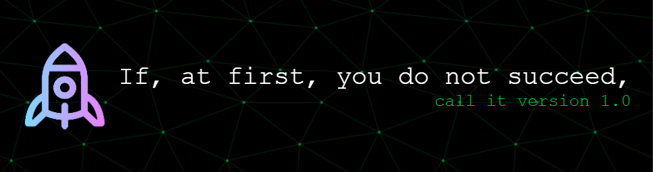

<h1 align="center">Hi 👋, I'm Abdur Rehman Khan</h1>
<h3 align="center">A passionate Software Engineer from Pakistan</h3>

  

- 🔭 Always learning

- :mortar_board: [OMSCS](https://omscs.gatech.edu/) graduate

- 👨‍💻 All of my projects are available at [https://arkfreestyle.wordpress.com/](https://arkfreestyle.wordpress.com/)

- :rocket: Let's build something excellent

<h3 align="left">Connect with me:</h3>

<h3 align="left">Backend:</h3>

<h3 align="left">Frontend:</h3>

<h3 align="left">Databases:</h3>

&nbsp;

<!-- 
This README was generated using the following resources:
1) https://leviarista.github.io/github-profile-header-generator/
2) https://rahuldkjain.github.io/gh-profile-readme-generator/
-->
